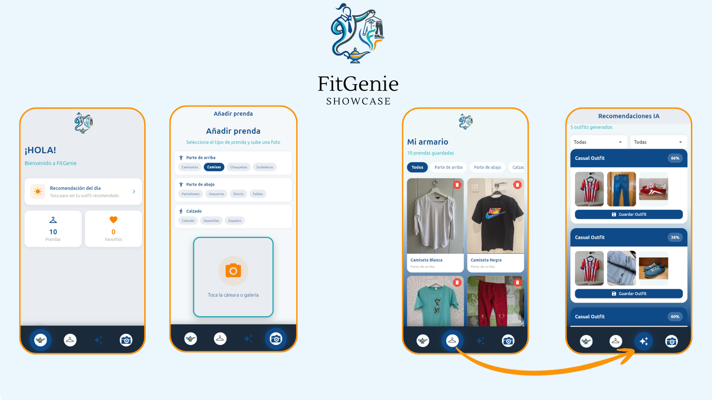

# FitGenie

Wardrobe management app with outfit recommendations. Flutter + Go backend.




## What it does

- Upload photos of your clothes (categories: t-shirts, pants, shoes...)
- Store them in the app with color and style info
- Request suggestions for occasions (work, dinner, casual)
- Get outfit recommendations based on what you own

## Tech Stack

| Layer | Technology |
|-------|-----------|
| Mobile | Flutter (Provider) |
| Backend | Go (Gin + GORM) |
| Database | PostgreSQL |
| Images | S3 (LocalStack for local) |
| Auth | JWT (ready to use) |
| Docs | Swagger at `/swagger/index.html` |

## Try it locally

### 1. Clone and start backend

```bash
git clone https://github.com/DavidNull/FitGenie.git
cd FitGenie

# With Docker (PostgreSQL + LocalStack S3 + Go API)
docker compose up -d

# Verify it's running
curl http://localhost:8080/health
```

### 2. Start Flutter

```bash
cd mobile
flutter pub get

# Choose your platform
flutter run -d linux        # Linux desktop
flutter run -d chrome       # Web
flutter run                 # Connected Android
```

**Note:** The app auto-detects the backend IP. No configuration needed.

### 3. Use the app

1. Tap "Use sample images" to load test data
2. Go to "Wardrobe" to see your clothes
3. Go to "Recommendations", pick occasion and season
4. Get outfit suggestions

## API

Interactive docs: `http://localhost:8080/swagger/index.html`

Main endpoints:
- `POST /api/v1/users` - Create user
- `GET /api/v1/users/me` - My profile
- `POST /api/v1/upload` - Upload image
- `GET /api/v1/clothing` - List my clothes
- `POST /api/v1/recommendations` - Request suggestions

## Scale to production

### Quick option: Firebase

To avoid maintaining your own backend, migrate to Firebase:

```dart
// Replace REST calls with Firebase
FirebaseFirestore.instance
  .collection('users').doc(uid)
  .collection('clothing').add(item)
```

Pros: No servers, auto-scaling, works offline  
Cons: Vendor lock-in, costs at scale

### Self-hosted: Kubernetes (k3s)

For self-hosting on cheap VPS (~$5/month):

```bash
# Deploy to k3s cluster
kubectl apply -f k8s/
```

Includes: Ingress with TLS, PostgreSQL with volume, 2 API replicas.

## Docker

Published image:

```bash
docker pull davidnull/fitgenie:latest
```

## Project Structure

```
FitGenie/
├── cmd/server/          # Go entrypoint
├── internal/
│   ├── api/handlers/    # HTTP handlers
│   ├── services/        # Business logic
│   ├── repository/      # DB access
│   └── models/          # Structs
├── pkg/
│   ├── auth/            # JWT
│   ├── database/        # PostgreSQL connection
│   ├── middleware/      # Auth, logging
│   └── storage/         # S3 client
├── migrations/          # SQL migrations
├── mobile/              # Flutter app
│   ├── lib/
│   │   ├── screens/     # UI screens
│   │   ├── providers/   # State (Provider)
│   │   └── services/    # API client
│   └── test/
├── k8s/                 # Kubernetes manifests
└── .github/workflows/   # CI/CD
```

## CI/CD

GitHub Actions runs on every push:
- `go fmt`, `go vet`, tests
- `flutter analyze`, `dart format`
- Docker build and push to Docker Hub

## TODO / Next Steps

- [ ] Real login in Flutter (currently uses device-id)
- [ ] Automatic image analysis (detect color/type)
- [ ] Backend unit tests
- [ ] Flutter widget tests

## License

MIT - Free to use and modify.
